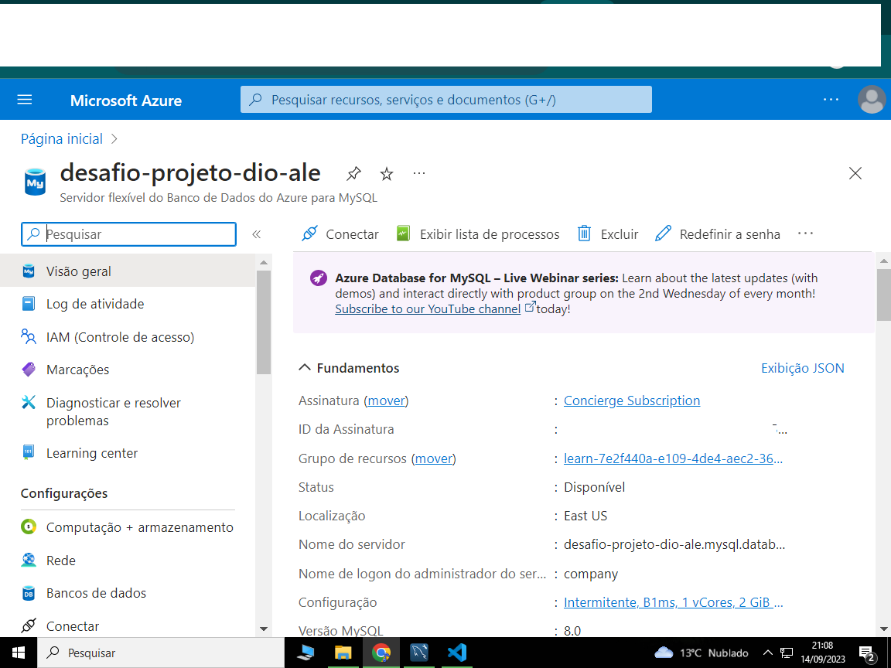

# DESAFIO DE PROJETO POWER BI 

## Processamento de dados com Power Bi e Azure.

### ***Ferramentas utilizadas***:

### ***Inicio***:
 
#### Criação do acesso a Microsoft Azure.
#### Criação de uma instância de MySQL.
#### Criação de um banco de dados a partir da refêrencia do github da professora Juliana Mascarenhas da DIO, utilizando Workbench mysql.
#### Criação de conexão do Power BI com o BD na Azure.

 
### ***Tratamento dos dados***:
 
#### Revisão de cabeçalho, troca de nomes das colunas.
#### Mescla de tabelas, employee e departament, remoção de colunas desnecessárias.

#### Criada uma nova tabela utilizando SQL com a query:

#### **SELECT** concat(Emp.Fname, ' ', Emp.Lname) AS Colaborador, **AS** Colaborador, Mgr.Fname **AS** Nome_Gerente **FROM** employee **AS** Mgr **JOIN** departament **AS** Dept **ON** Mgr.Ssn = Dept.Mgr_ssn **LEFT JOIN** employee **AS** Emp **ON** Dept.Dnumber = Emp.Dno **ORDER BY** Nome_Gerente, Colaborador;

 
#### Coluna com nome e sobrenome de colaboradores mesclada.
#### Coluna com nome e localização do departamento mesclada.
#### Foi usado mesclar e não atribuir pois o mesmo causa varios erros e inserções de campos "null".

### ***Relatório***
  
#### Relatório criado no Power BI;
#### Cards (quantidade de colaboradores), (quantidade de projetos), (quantidade de departamentos).
#### Mapa (quantidade de colaboradores e soma de salários por UF e Cidade).
#### Gráfico de pizza (quantidade de colaboradores por gerente).
#### Gráfico de rosca (soma de horas por projeto).
#### Relatório criado e postado no Power BI SERVICE.

